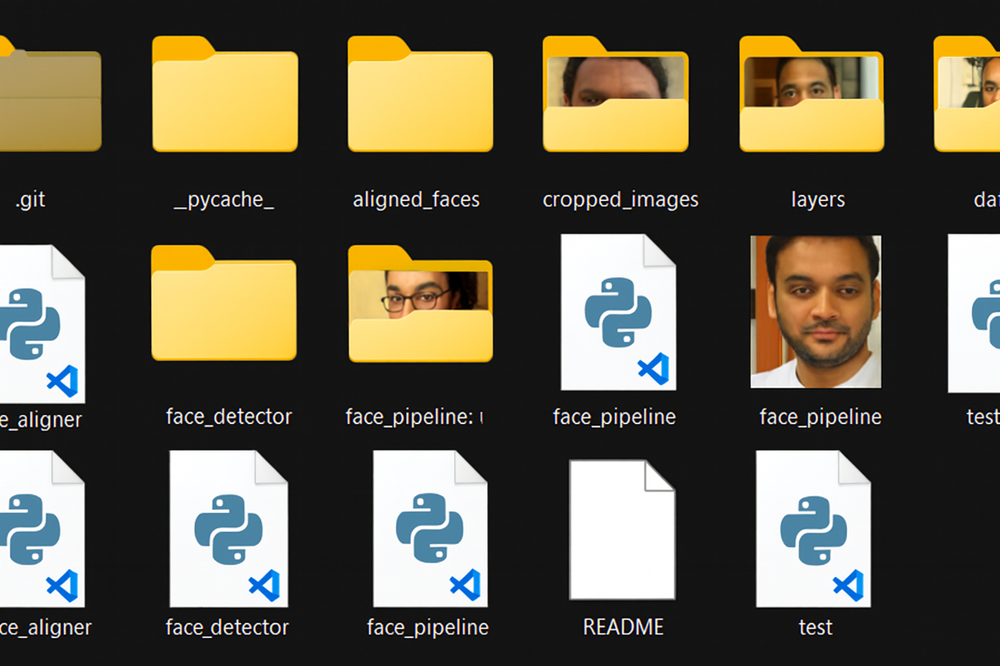

# 🧠 Model Weights — Face Authentication Pipeline

This folder contains (or should contain) the **pretrained model weights** required by the **Face Authentication Pipeline**, which uses:

- **RetinaFace** → for face detection  
- **InceptionResnetV1 (VGGFace2)** → for embedding generation  
- *(Optional)* **AdaFace (IR-50)** → for advanced adaptive embeddings

---

## 📦 Required Weights Summary

| Model | File Name | Purpose | Source Repository |
|--------|------------|----------|------------------|
| **RetinaFace** | `Resnet50_Final.pth` | Face Detection | [biubug6/Pytorch_Retinaface](https://github.com/biubug6/Pytorch_Retinaface) |
| **VGGFace2 (facenet-pytorch)** | *(auto-downloaded)* | Face Embedding | [facenet-pytorch](https://github.com/timesler/facenet-pytorch) |
|

---

## 🧩 Folder Placement




## 🔩 1️⃣ RetinaFace Detector Weights

**Required for:**
- `face_detector.py`
- `face_pipeline.py`

**File Name:** `Resnet50_Final.pth`

### 📥 Download Steps:
1. Visit the official RetinaFace repository by **biubug6**:
   👉 [https://github.com/biubug6/Pytorch_Retinaface](https://github.com/biubug6/Pytorch_Retinaface)

2. Locate the pretrained model in:

Pytorch_Retinaface/weights/Resnet50_Final.pth


### ⚙️ Optional (RetinaFace Installation)
If you haven’t already cloned the RetinaFace repo:
```bash
git clone https://github.com/biubug6/Pytorch_Retinaface.git
cd Pytorch_Retinaface
pip install -r requirements.txt
python setup.py install
